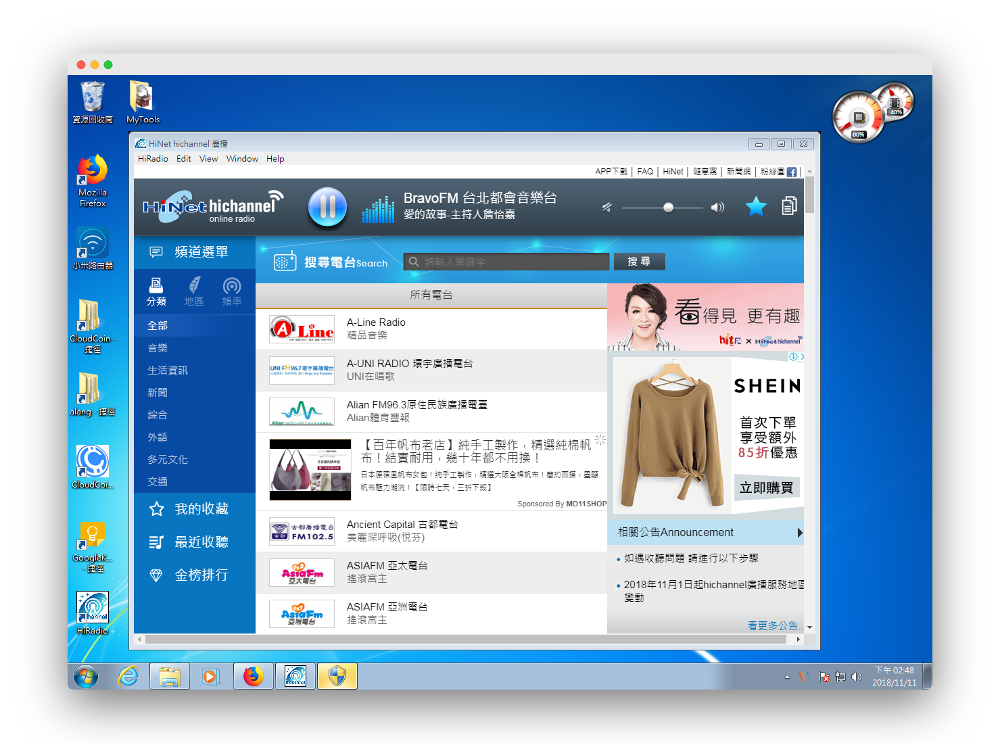
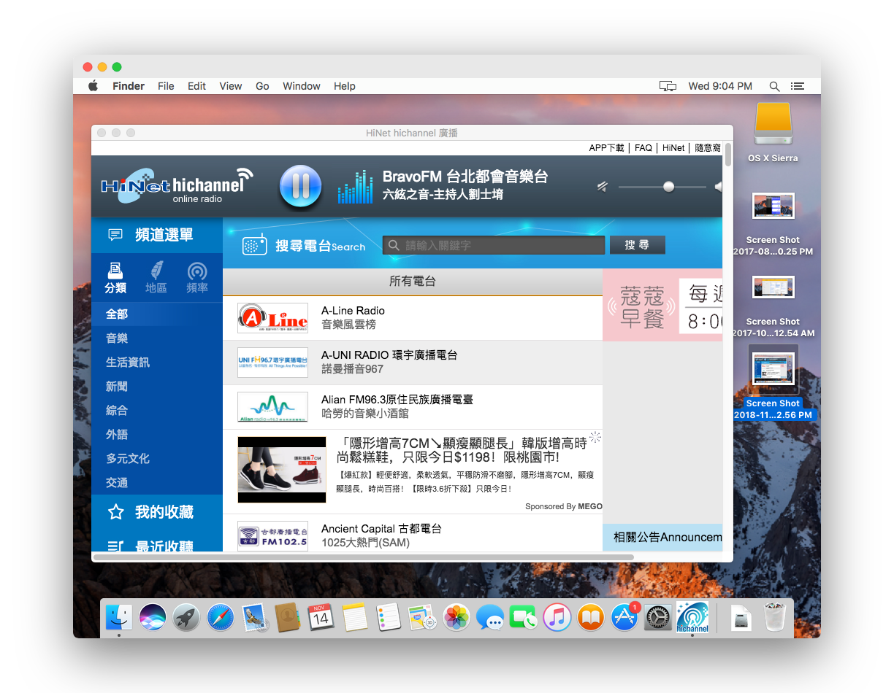

# HiRadio 
The Desktop APP for [HiNet hichannel Online Radio][hichannel] packaged with [Electron][electron].

With the APP, you can listen to all of local radio stations in Taiwan no matter where you are in the world.

Hoping you enjoy it.


Linux


Windows


Mac


## Install
Go to [Release][release] to download the packages for all OS.

* Linux: HiRadio-1.0.0-x86_64.AppImage (64-bit), HiRadio-1.0.0-x86_64.tar.gz (64-bit)
* Mac: 
* Windows: HiRadio Setup 1.0.0.exe (64-bit), HiRadio-1.0.0-win.zip (64-bit, portable version)

## How to use
1. *NOTE: the advertisement could be played for 30 seconds when you start the application every time, which is generated by [HiNet][hichannel] website instead of the application self.*
2. Support bookmark for favorite radio stations.

## Optional: Create Electron Development
```sh
git clone https://github.com/a-lang/hiradio.git
cd hiradio
npm install
```

## Optional: Build the distribution files
Build the application for specified platform:

```sh
npm start
npm run dist:linux
npm run dist:mac
npm run dist:win
```

## License
Active Record is released under the [MIT license][license]


[hichannel]: https://hichannel.hinet.net/radio/index.do
[electron]: http://electron.atom.io
[license]: https://opensource.org/licenses/MIT
[release]: https://github.com/a-lang/hiradio/releases
